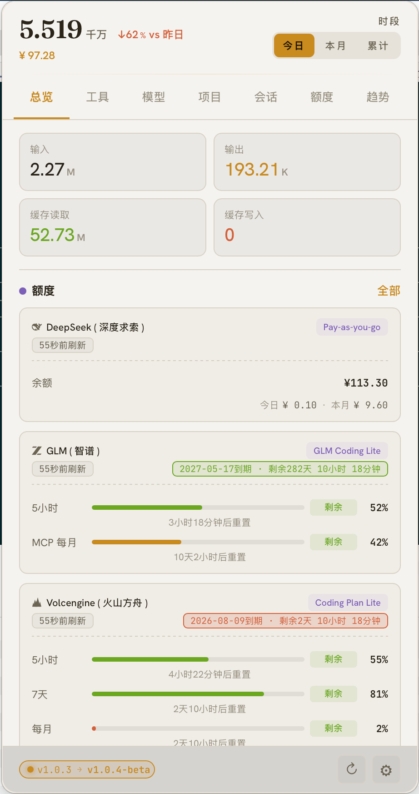
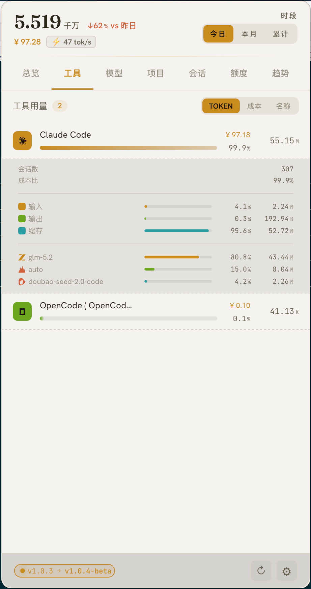
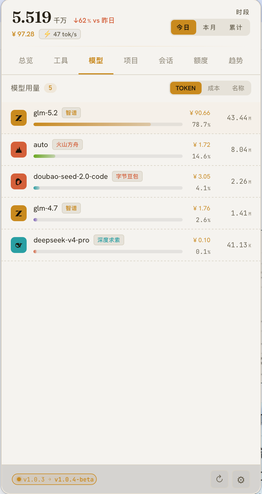
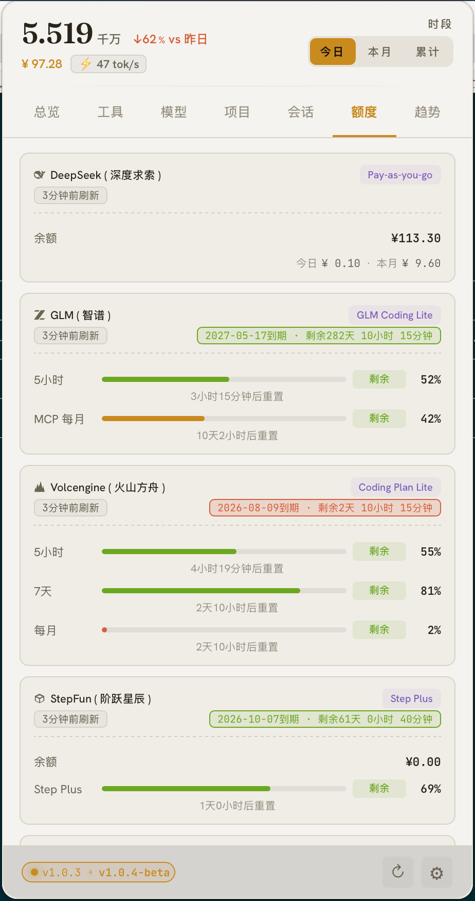
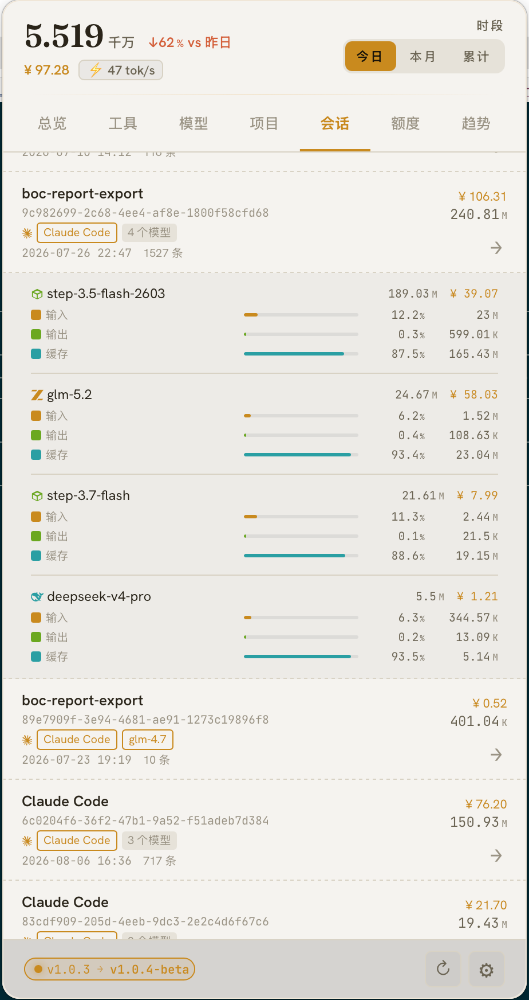
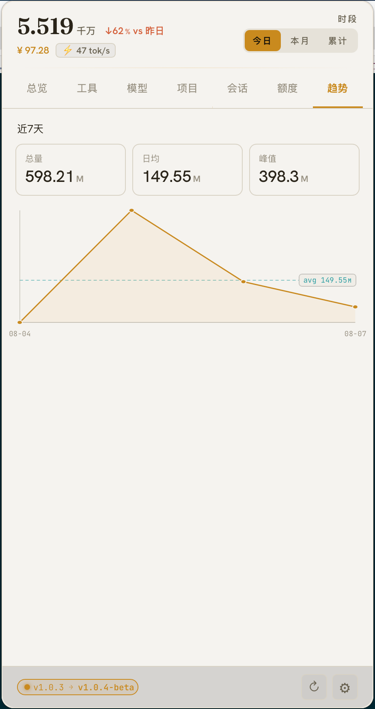
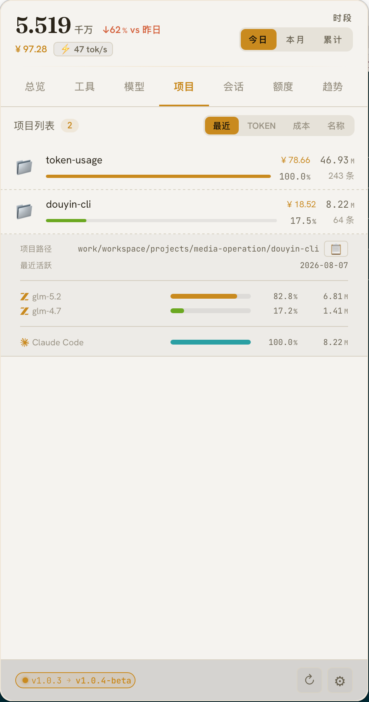
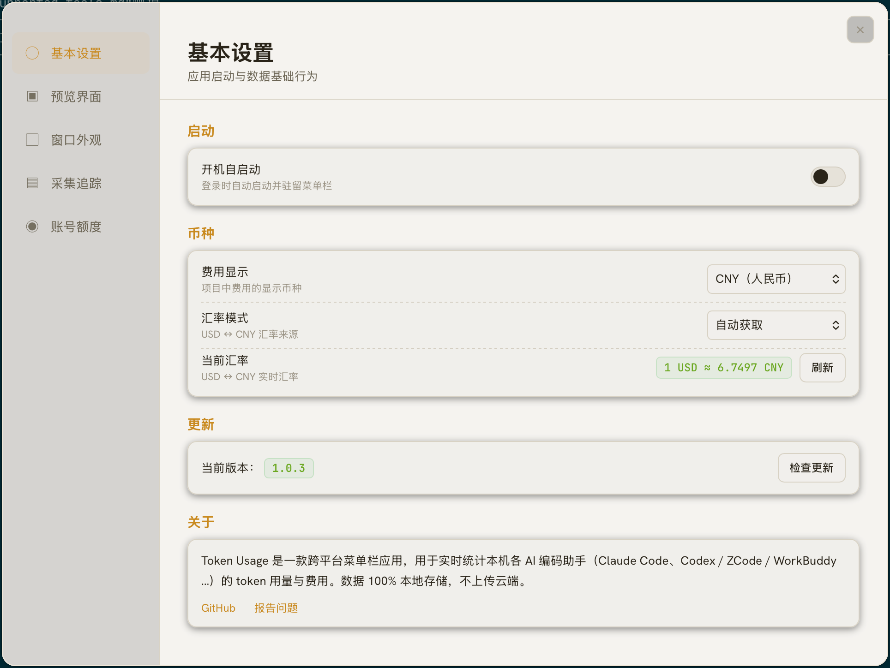
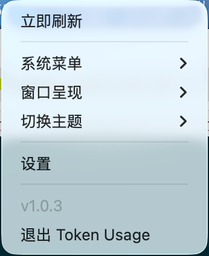

<p align="right">
   <strong>English</strong> | <a href="./README.md">简体中文</a>
</p>

<div align="center">
    
    <h1>Token Usage</h1>
</div>

<p align="center">
    <em>A menu bar / system tray widget that fits 18+ AI coding assistants' tokens, costs, and quotas into the macOS top bar or the Windows / Linux tray.</em>
</p>

<p align="center">
    <a href="https://github.com/lzc0088/token-usage/releases"></a>
    <a href="https://github.com/lzc0088/token-usage/releases"></a>
    
    
    
    <a href="LICENSE"></a>
</p>

## What is Token Usage?

A **Tauri 2**-based, cross-platform menu bar / tray app that tracks **token usage and cost** for every AI coding assistant on your machine, in real time:

- Covers **Claude Code, Codex, ZCode, OpenCode, Qoder, Trae, Cursor, Copilot, DeepSeek, Kimi, GLM**, and 18+ more
- Side-by-side **vendor quota for 17 providers** (Claude / Codex / Cursor / OpenRouter / GLM / Kimi / Volcengine / Ollama / Minimax / …)
- **100% local data** — no cloud, no prompt/response upload, no account required

> Status: **v1.0.3** · All features shipped, three-platform installers via CI, in-app auto-update.

## Supported Tools

Token Usage provides **token usage, vendor quota, and session detail** for each tool (data path = the tool's local storage location):

| Tool | Data path | Token usage | Quota | Session detail |
|------|-----------|:---:|:---:|:---:|
| **Claude Code** | `~/.claude/projects/` | ✅ | ✅ | ✅ |
| **Codex** | `~/.codex/sessions/` | ✅ | ✅ | ✅ |
| **ZCode / GLM** | `~/.zcode/projects/` | ✅ | ✅ | — |
| **OpenCode** | `~/.local/share/opencode/` | ✅ | — | ✅ |
| **Cursor** | `~/.config/tokscale/cursor-cache/` | ✅ | ✅ | — |
| **GitHub Copilot** | VS Code `workspaceStorage/*/chatSessions/` | ✅ | ✅ | — |
| **Kimi CLI / Kimi Code** | `~/.kimi/sessions/`, `~/.kimi-code/sessions/` | ✅ | ✅ | — |
| **DeepSeek** | DeepSeek API key | — | ✅ | — |
| **OpenRouter** | OpenRouter API key | — | ✅ | — |
| **Minimax** | Minimax API key | — | ✅ | — |
| **Volcengine** | Volcengine Ark API key | — | ✅ | — |
| **Grok (xAI)** | `~/.grok/sessions/` | ✅ | ✅ | — |
| **Qoder** | Qoder dashboard cookie | — | ✅ | — |
| **Ollama Cloud** | Ollama Cloud cookie | — | ✅ | — |
| **iFlytek** | iFlytek Spark API credentials | — | ✅ | — |
| **Stepfun** | Stepfun API key | — | ✅ | — |
| **MiMo Code** | `~/.local/share/mimocode/mimocode.db` | ✅ | ✅ | — |
| **Qwen CLI** | `~/.qwen/projects/` | ✅ | — | — |
| **Trae** | (via tokscale adapter) | ✅ | — | — |
| **Hermes / Zed / Cline / Kiro / CodeBuddy / WorkBuddy / Proma / Pi**, etc. | (see tokscale's supported list) | ✅ | — | — |

## Showcase

<table>
<tr>
<td width="290" align="center"><br><sub>Home — today's I/O/cache split, Top 3 tools/models/quotas, real-time rate</sub></td>
<td width="290" align="center"><br><sub>Tools — usage breakdown by dimension, expandable cache-hit detail</sub></td>
<td width="290" align="center"><br><sub>Models — usage and cost per model, aggregated across tools</sub></td>
</tr>
<tr>
<td width="290" align="center"><br><sub>Quotas — 17 providers' balance / consumption windows / expiry, three credential types</sub></td>
<td width="290" align="center"><br><sub>Sessions — by tool × project; click to open a single session's per-model detail + rounds</sub></td>
<td width="290" align="center"><br><sub>Trends — last 7 days / month line chart, daily average + peak</sub></td>
</tr>
<tr>
<td width="290" align="center"><br><sub>Projects — auto-grouped by workspace/repo, derived from session JSONL cwd</sub></td>
<td width="290" align="center"><br><sub>Settings — 5 separate windows: General / Preview / Window / Collection / Quotas</sub></td>
<td width="290" align="center"><br><sub>Menu bar / Tray — icon + custom readout (today/total tokens or cost) + context menu</sub></td>
</tr>
</table>

## Why Token Usage?

Most usage monitors are designed for **a single device** and require you to **log in on a website first**. Token Usage is a **Tauri 2 + local-first** menu bar widget:

- **Read your own disk** — no backend, no prompt/response upload, everything stays on your machine
- **Lives in the menu bar / tray** — never steals your main window; one click for today/total usage and quota headroom
- **In-app one-click update** — detect new version → download → verify → install → prompt to restart, no browser
- **Two independent channels** — tokens go through tokscale, quotas go through credential → vendor API, no cross-contamination

## Features

### Usage tracking

- **Real-time token tracking** for 18+ AI tools (Claude Code, Codex, ZCode, OpenCode, Qoder, Trae, …) — UI refreshes seconds after each turn
- **Per-session detail** — open one session to see tokens per prompt, with model and tools used
- **Cache-hit statistics** — click any tool/model to expand input token (cache hit vs miss), output token, and hit-rate breakdown
- **Cost & currency** — cost shown alongside token count; USD / CNY display, daily auto-updated exchange rate with manual override
- **Project / workspace grouping** — reverse-engineer the project name from session JSONL `cwd`; aggregate by workspace or repo
- **Live rate readout** — output tokens/s (model-busy time) or total tokens/min (burn rate), configurable

### Quotas, trends & settings

- **AI tool quota** — 17 providers' session / weekly / billing / credits windows: DeepSeek prepaid balance, OpenRouter usage limit, Minimax Token Plan, Volcengine Ark Coding Plan, and more
- **Multi-account / multi-credential** — one provider, multiple accounts; OAuth (Copilot / Codex), API Key, Cookie, all three credential types co-exist; credentials are AES-256-GCM encrypted with a machine-derived key
- **Usage trends** — last 7 days / month line chart with daily average and peak
- **Auto-update** — in-app download + signature verify + install + prompt to restart; force check supported, 1h cache cooldown
- **5-section settings** — General / Preview / Window / Collection / Quotas, each opens in its own window

### Collection & interface

- **Three collection modes** — live (file-watch push) / smart (10min interval + activity-aware) / fixed interval
- **Session retention & archive** — even after a tool is uninstalled or its old sessions are pruned, your local stats persist; archived sessions can be viewed / cleared in Settings
- **Menu bar / tray** — macOS menu bar, Windows system tray, Linux system tray; readout modes: today / total tokens / cost / icon-only
- **Window modes** — popover (default), pinned, always-on-top; global hotkey to summon
- **Theme & appearance** — dark / light / follow system; glass opacity and blur adjustable; fully transparent window
- **i18n** — Simplified Chinese and English

## Installation

Download from [GitHub Releases](https://github.com/lzc0088/token-usage/releases):

- **macOS (Apple Silicon)** — `.dmg`, signed + notarized (Developer ID)
- **Windows 10 / 11** — NSIS `.exe` installer
- **Linux x64** — `.AppImage`

Packaged builds auto-check GitHub Releases. When an update is available, open **Settings → General** and click **Install now** to download and install in-app. Push a tag to trigger three-platform builds and a GitHub Release:

```bash
git tag v1.0.3 && git push origin v1.0.3
```

GitHub Actions builds on three runners (mac aarch64 / Windows x64 / Linux x64) and uploads installers directly to the GitHub Release. In-app **Check for updates** picks it up automatically.

> **In China mainland:** first-launch tokscale download and the GitHub Release CDN may be slow. The app reads the system proxy automatically (macOS `scutil` / Windows registry / Linux `HTTPS_PROXY`). You can also start with `TOKSCALE_REGISTRY=https://registry.npmmirror.com npm run tauri dev` to point npm at a mirror.

### First run

The app launches into a **menu bar / tray** mode by default. **No account or signup needed** — open and use. To check vendor quotas, fill in the corresponding credential in **Settings → Quotas** (API Key / Cookie / OAuth).

## Build from source

```bash
# Prereqs: Rust stable, Node 22+, macOS needs Xcode Command Line Tools
npm install
npm run tauri dev    # dev (vite :1420 + Rust backend + popover window)
npm run tauri build  # three-platform installers
npm run check        # svelte-check type check
```

### Common commands

```bash
# frontend
npm run dev             # vite only
npm run build           # frontend build → dist/
npm run check           # svelte-check
npm test                # vitest

# backend (cd src-tauri/)
cargo test --lib               # unit tests
cargo clippy -- -D warnings    # lint
cargo fmt --all -- --check     # format check
```

## Project structure

```
src/                        # Svelte 5 frontend
  components/               # popover / segments / settings / common
  stores/                   # period / segment / modules
  lib/                      # api.ts, format.ts, i18n, quota-format, meta
src-tauri/                  # Rust backend
  src/
    lib.rs / state.rs       # entry + global state
    collector/              # tokscale → scheduler → snapshot
    storage/                # SQLite schema migration + read/write
    commands/               # Tauri #[command] (query / settings / quota / credential / update / …)
    query/                  # query engine (summary / breakdown / trends / sessions)
    quota/                  # 17 vendor quota adapters + scheduler
    auth/                   # encrypted credential store
    config/                 # user config kv
    ui/                     # window / tray management
    utils/                  # proxy / http / file / log
  tauri.conf.json           # window / tray / bundle (bundle.resources injects tokscale)
```

## App data

App state lives in the OS user-data dir — delete it along with the app to fully uninstall.

| Platform | Path |
|----------|------|
| macOS | `~/Library/Application Support/token-usage/` |
| Windows | `%APPDATA%/token-usage/` |
| Linux | `~/.config/token-usage/` |

## How it works

```text
menu bar / tray app
  ├─ collector thread ──▶ tokscale (sidecar) ──▶ ~/.claude, ~/.codex, ~/.zcode, ...
  │                       │                       (parse JSONL → aggregate tokens)
  │                       ▼
  │                   SQLite (WAL) ◀─── query/ engine ───▶ Svelte 5 frontend
  │                   ├ daily_usage
  │                   ├ sessions
  │                   ├ quota_cache
  │                   └ app_config
  │
  └─ quota thread ──▶ credential store (keyring/encrypted KV) ──▶ vendor API
                      Claude / Codex / Cursor / OpenRouter / Volcengine / ...
                      (OAuth via device code, Cookie via dashboard, API Key via balance)
```

The collector and quota threads run independently; all network requests honor the system proxy (macOS / Windows / Linux).

## Privacy

Token Usage processes logs locally and **never sends your prompts, responses, or source code to any remote service**. Network access is limited to:

- In-app update check (GitHub Releases)
- Documented vendor quota queries (official vendor APIs, credentials supplied by you locally)

The app does not:

- Upload your prompts, responses, code, or file contents
- Collect telemetry, analytics, or crash reports
- Call any cloud-side usage aggregation service

## Acknowledgments

- [tokscale](https://github.com/junhoyeo/tokscale) — log parsing and token accounting
- [tauri](https://github.com/tauri-apps/tauri) — cross-platform native windows and IPC
- [CodexBar](https://github.com/steipete/CodexBar) — vendor quota research

## License

[MIT](LICENSE) © [Ze Chuan](https://github.com/lzc0088)
